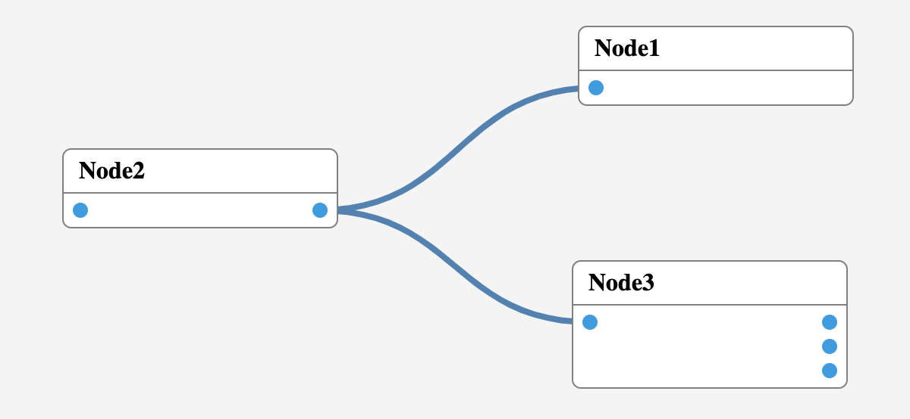

# **Onboard**

Onboard is an extensible framework for visual programming. Onboard allows you to create a node editor from the browser. You can define nodes and events that allow you to create instructions to process data in your editor.

Onboard is based on [d3.js](https://d3js.org/).

## How it works?

- [x] No canvas.
- [x] Based on [d3.js](https://d3js.org/).

## Extensions

- [x] Connectors.
- [ ] Autopositioning.
- [ ] minimap.

## TODO

- [ ] Export/Import JSON.
- [x] Events.
- [x] Node Connector.
- [ ] Pin protection.
- [ ] Control: Input
- [ ] Control: Label.
- [ ] Avoid cyclic connections.
- [ ] Demo website.

## Example

```ts
import { Editor, NodeComponent, Pin } from "./Onboard";
import * as Connector from "./Onboard/extensions/connectors.ext";

const root = "#root";

const Node1 = new NodeComponent({ title: "Node1" });
const Node2 = new NodeComponent({ title: "Node2" });
const Node3 = new NodeComponent({ title: "Node3" });

const editor = new Editor({
    name: "schema1",
    root,
    nodes: [Node1, Node2, Node3]
});

Node1.addInput(new Pin("out1", "Output 1"));

Node2.addInput(new Pin("in1", "Input 1"));
Node2.addInput(new Pin("in2", "Input 2"));
Node2.addOutput(new Pin("out1", "Output 1"));

Node3.addInput(new Pin("in1", "Input 1"));
Node3.addOutput(new Pin("out1", "Output 1"));
Node3.addOutput(new Pin("out2", "Output 2"));
Node3.addOutput(new Pin("out3", "Output 3"));

editor.install(Connector);
```

## Development

1. Clone
2. `npm install`
3. `npm run start`
4. Open http://localhost:1234

**License**

[MIT](./LICENSE)

**You are free to contribute to this project. :)**